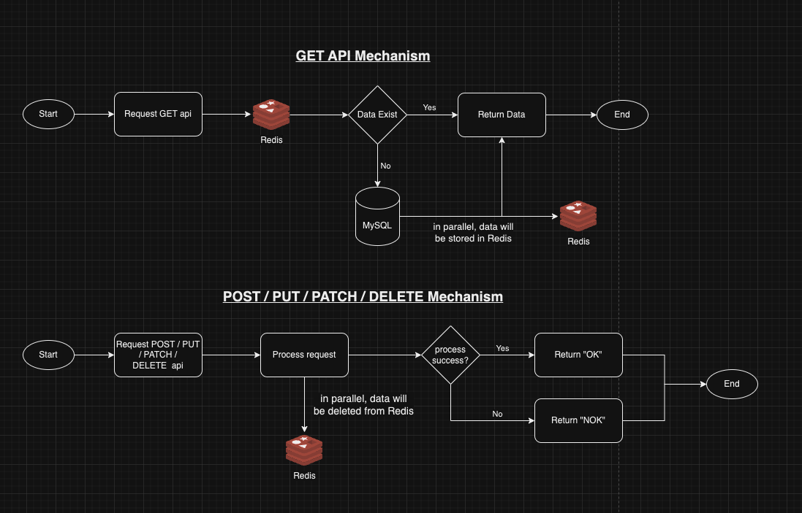
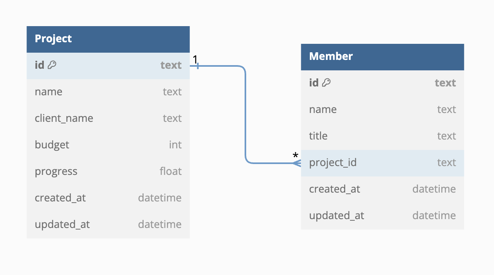
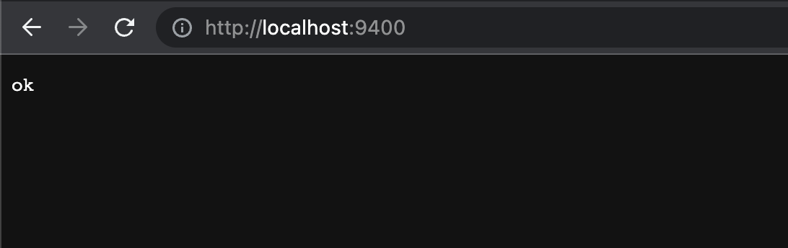

# DOT Coding Test
Nama: Rahadian Ardya Kotopanjang

## Asumsi
Saya akan membuat serangkaian API untuk handle Project management beserta team yang terlibat.

### Stack yang digunakan
```
Language: Golang
Cache: Redis
Database: MySQL
```

### Process Diagram
Berikut ini adalah process diagram untuk masing masing API



### Relational Database
Berikut ini adalah diagram relational database



## Installation
Di dalam project ini, saya sudah menggunakan auto migration yang sudah disediakan oleh `GORM`.

Yang perlu dilakukan selanjutnya adalah Setup config `mysql` adan `Redis` pada `config` file sesuai dengan environment yang dimiliki.

Untuk menjalankan aplikasi, run script berikut
```
go run main.go
```

Setelah itu, running `dummy.sql` yang berada di berlokasi di `dummy_data/dummy.sql` untuk import dummy data.

Untuk memastikan aplikasi running, bisa mengunjungi url berikut:
```
http://localhost:9400/
```
akan muncul seperti berikut.



## List API
Berikut adalah list API yang terdapat pada project ini.
Untuk mempercepat, sudah tersedia file `DOT.postman_collection.json` yang bisa di import ke postman

### [GET] Get Project
Untuk mendapatkan semua list project

### [GET] Get Project by ID
Untuk mendapatkan data project filter by ID

### [POST] Create Project
Untuk membuat project baru

### [UPDATE] Update Project
Untuk update existing project

### [PATCH] Progress
Untuk update progress project

### [DELETE] Delete Project
Untuk delete existing project